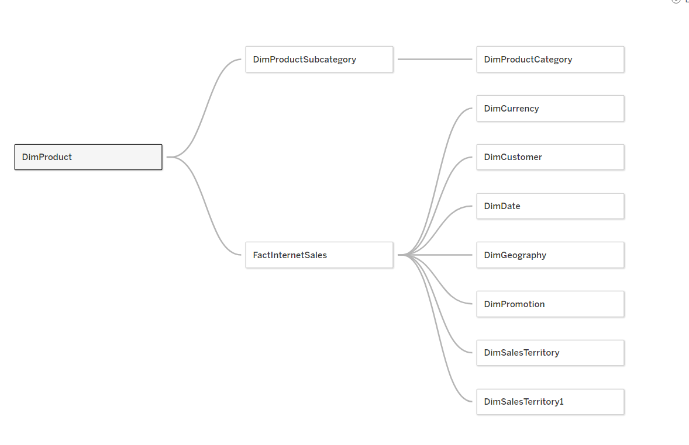
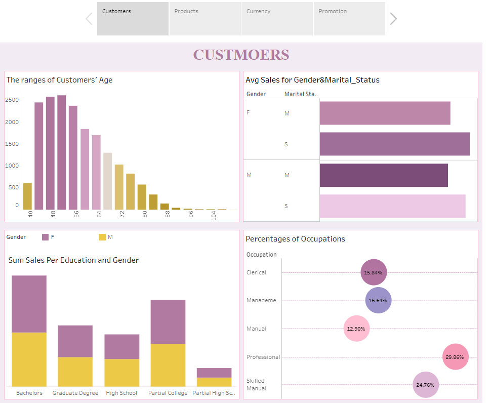
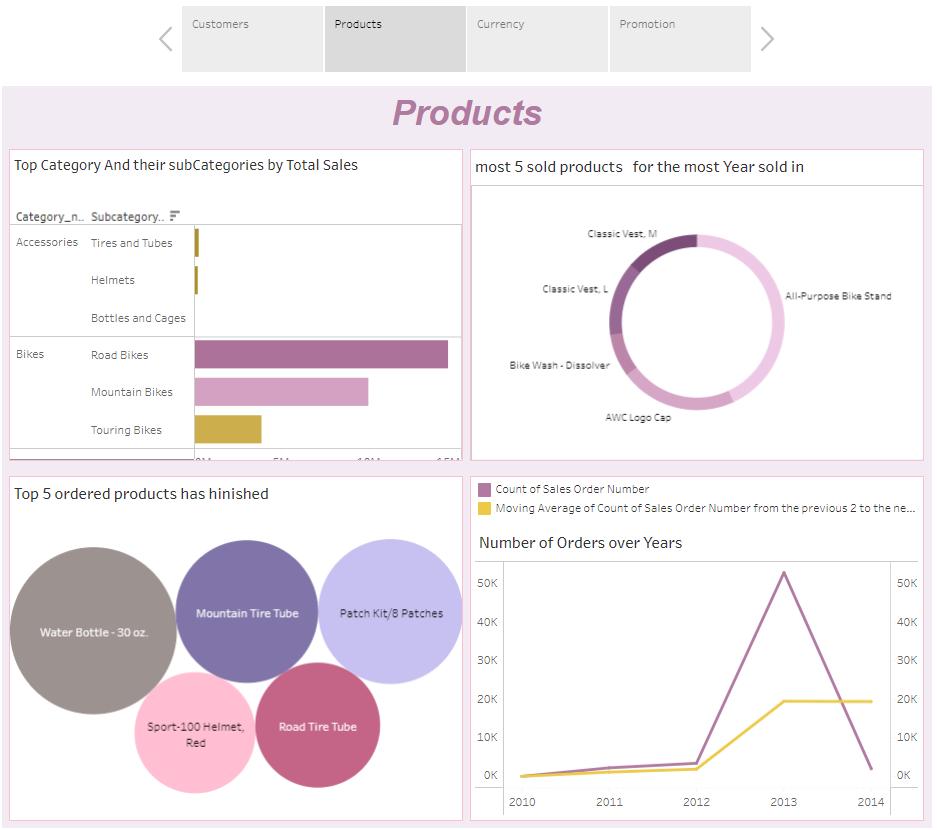
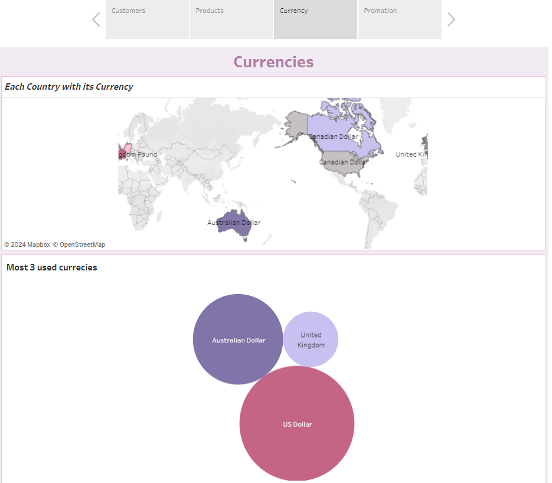
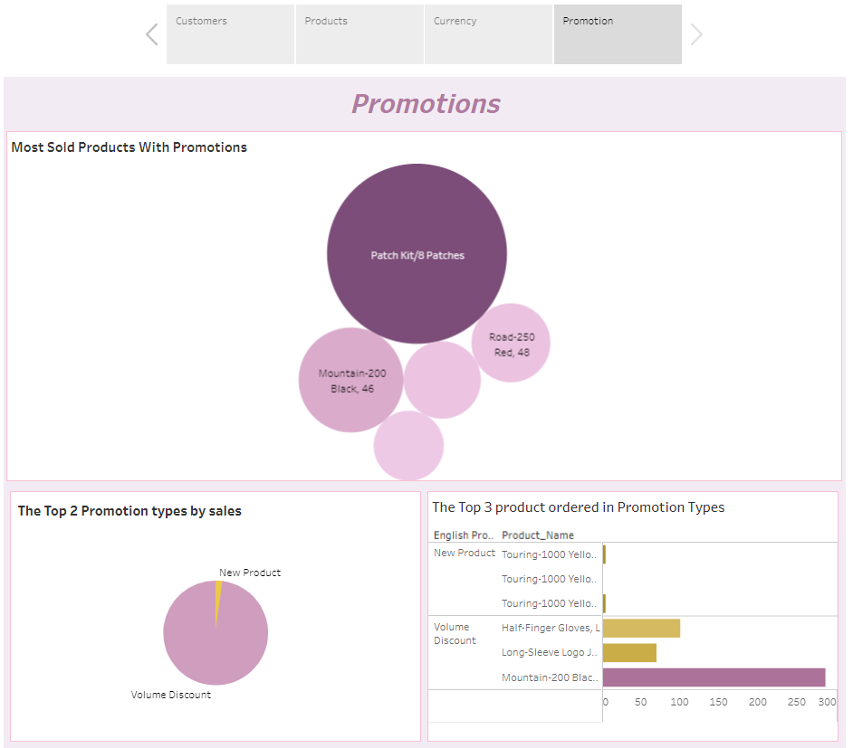

# Tableau Project Showcase

## Overview

🚀 Welcome to the Tableau Project Showcase! This repository highlights an exciting Tableau project that leverages InternetSales_Dw in Adventure_Works_DWH dataset. Dive into the world of data visualization and analytics to uncover valuable insights into customer behavior, product performance, currency impacts, and promotional strategies.

## Project Highlights

### 1. Strong Foundations

🔗 **Established Strong Foundations:**
   - Initiated the project by weaving intricate relationships between tables to ensure a robust foundation for data analysis. 🤝🔍
    

### 2. Insightful Dashboards

📈 **Crafted Insightful Dashboards:**
   - Presented 4 dynamic dashboards providing a 360-degree view of the business: 
     1️⃣ **Customer Dashboard:** Uncover valuable insights into customer behavior, preferences, and trends. 
     
     
      

     2️⃣ **Products Dashboard:** Dive deep into product performance, sales trends, and inventory management.
      
     
     
      

     3️⃣ **Currencies Dashboard:** Explore the impact of currency fluctuations on business operations and financials.
      
     
     
      

     4️⃣ **Promotions Dashboard:** Decode the effectiveness of promotional strategies and their impact on sales.
      
     
     
      

### 3. Adventure Works Database

💡 **Why Adventure Works Database?**
   - Adventure Works served as the perfect playground for this project, offering a rich dataset that allowed for comprehensive analysis and visualization. 🌐📊

### 4. Visual Storytelling

🎨 **Visual Storytelling:**
   - Emphasized the power of visual storytelling through Tableau's intuitive design, transforming raw data into actionable insights. 🖼️📈

### 5. Impactful Decision-Making

🚀 **Impactful Decision-Making:**
   - By blending creativity with analytical rigor, this project aims to empower decision-makers with the tools they need for strategic and informed choices. 🛠️📉

## How to Explore

👉 **Check out the dashboards and let me know your thoughts!**
   - [Explore the Dashboards](https://public.tableau.com/app/profile/dina.ahmed1077/viz/ALL_SHEETS/Story1)

## Acknowledgments

🙌 **Thank you to the Tableau community for continuous inspiration and support!**
   - Let's keep transforming data into meaningful stories! 💬🚀
